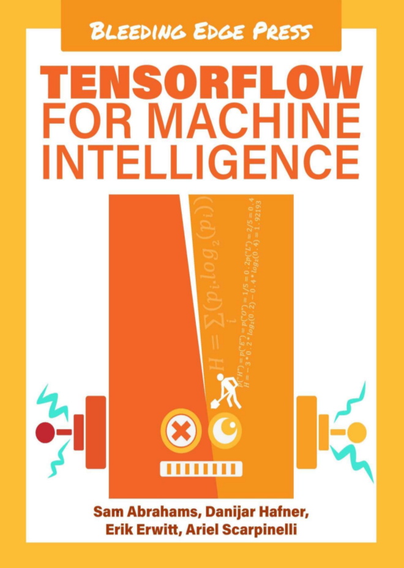
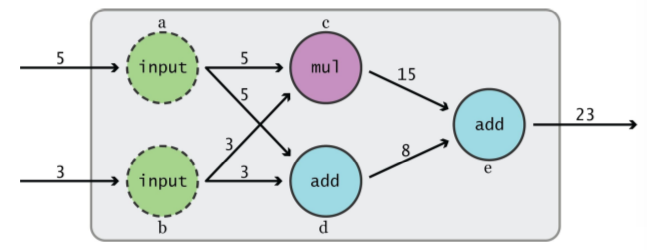
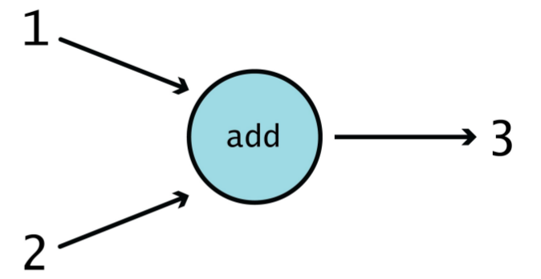
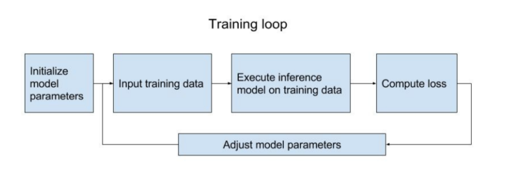

## TensorFlow	for	Machine Intelligence



A Hands-On	Introduction to	Learning Algorithms
Sam Abrahams
Danijar	Hafner
Erik	 Erwitt
Ariel Scarpinelli
----
本书中提到的案例均已验证，可以再Tensorflow r0.11 中使用
----


## Library	for	numerical	computation

数值计算的类库
在Tensorflow中包含有数值计算的工具包[ “learn”（AKA SCikit Flow）](https://github.com/tensorflow/tensorflow/tree/master/tensorflow/contrib/learn/python/learn)  ,  同时模拟[Scikit-Learn](scikit-learn.org/stable/)  的单行建模功能 。TensorFlow 所提供的不是一个开箱即用（out-of-the-box）的机器学习解决方案。与之相反，Tensorflow提供了一套可以扩展的函数和允许用户从数学上定义模型的类。 这就使得有技术背景的用户可以自由的组合模型，迅速且直观的构建模型。另外TensorFlow 还支持ML特定函数，适合于复杂的数学计算。

因此本书着眼于 使用Tensorflow用户关于创建机器学习模型。


##  Data flow graphs
Tensorflow的计算模型就像一个有向图。 这个图中节点代表函数以及操作，这个图的边代表数字或者矩阵or 张量（张量可以看做矩阵）



有以下几个原因说明这种编程模型是有用的：
首先，很多的教程中的机器学习模型已经可视化有向图（例如 [神经网络](https://en.wikipedia.org/wiki/Artificial_neural_network)）。这些有向图的对于从业人员来说更加自然。
其次，

最后，


---
#### Quick	aside:	what	is	a	tensor?
简单的来说，tensor就是n维的矩阵。所以，二维的tensor和一个标准的矩阵一样。（标准矩阵是二维的）。在视觉上，m×m的矩阵可以看做一个数组（m 是数组的高，m 是数组的宽）。m×m×m的tensor是 可以看做一个宽高长为m的立方体。简而言之，可以把tensor看作为矩阵。

---

#### Beyond	the	one-sentence	description

这句话的“open source software library for numerical computation using data flow graphs（使用数据流图的数字计算的开元类库）”包含了很多信息，但是这句话不能够描述Tensorflow成为机器学习库的原因。

#### Distributed
正如之前在介绍数据流图（data flow graph）所提到的那样，Tensorflow被设计成一个可以伸缩的框架，既可以通过多个计算机进行扩展，也可以在一台机器上使用多个GPU或CPU的方式进行扩展。虽然在最初的开源时并没有分布式计算的能力，但是到了0.8.0版本的时候就已经将分布式的功能集成到Tensorflow内建类库中了。虽然初始分布式的运行环境（runtime）比较麻烦，但是会使得Tensorflow变得十分的强大。绝大多数的机器学习框架是没有这么牛逼的功能的。使用Tensorflow的时候一定要注意与本地正在运行（bing worked on）集群管理工具的兼容性。(	it’s	important	to	note	that	native	compatibility	with	certain	cluster	managers	(such	as Kubernetes)	are	being	worked	on.) 
#### A suite of software
(Tensorflow的软件套装)

虽然“Tensorflow ” 主要是指的用于构建和训练机器学习模型的API，实际上Tensorflow是一套软件，用于以下方式的也可以称为tensorflow:

[**TensorFlow **](https://www.tensorflow.org/versions/master/api_docs/index.html)  是 用于 定义机器学习模型、并且使用这些模型训练数据 API（应用程序接口)。同时这些API对提供了对训练后输出的进一步使用方法。
这些API主要可以通过C++ 和 python语言调用，实际上Tensorflow API是由C++ 语言写的。 这使得 数据的科学计算可以在更加友好的Python环境中计算，通过C++代码编译运行。虽然也有C++ 的API 可以运行模型但是它（C++ 的API）有时候会受限， 对于绝大多数用户来说不建议使用。

[**TensorBoard**](https://www.tensorflow.org/versions/master/how_tos/graph_viz/index.html)  是一个可视化tensorflow图像的工具。当用户在tensorflow中包含有对tensorBoard的指定操作，那么tensorBoard 就可以阅读从Tensorflow中导出的文件，并且可视化Tensorflow的图以及模型的动作。这种可视化对于统计结果、分析模型、调试代码都很有帮助。早点接触tensorboard并且结合Tensorflow使用会使得更加有意义。

[** TensorFlow Serving **](https://tensorflow.github.io/serving/)  是一个有利于（促进）部署预先训练好的Tensorflow模型的软件。用户可以通过Tensorflow中的内建函数（BIF）导出模型到一个文件中。使用Tensorflow Serving 来本地的读取这个文件。可以从简单高可用性的服务（server）开始输入数据，并且传递（pass）给一个训练好的模型，然后返回模型的输出（output）。另外，Tensorflow可以无缝地在新旧模型之间进行切换，对于最终用户而言不会出现宕机时间。（这意味着在开发中，我们可以使用tfs来更换模型）。可能服务（server）会是Tensorflow生态系统中最不被认可的部分， 但是这或许是Tensorflow最具有竞争力的地方。将Server与生产环境结合，是的用户们可以避免重复的实现他们的模型，用户只需要传递Tensorflow导出的模型即可。Tensorflow Serving 完全是使用C++ 实现的，目前也只有C++ 的API。

我们相信，将Tensorflow用到极致的情况就是将以上三种互相结合。（using	TensorFlow	to	its	fullest	means	knowing	how	to	use	all	of	the
above	in	conjunction	with	one	another.	）所以，本书将涵盖这三部分软件。

~~星期一, 28. 十一月 2016 08:13下午 ~~

###  When	to	use	TensorFlow###
什么情况下使用Tensorflow？
让我们看看一些Tensorflow的用例（use case）。事实上，Tensorflow应该是大多数机器学习中最佳的选择。以下的使用列表可以指出了Tensorflow的目的：

**使用机器学习来 研究、开发并且迭代 新的机器学习架构**
由于tensoerflow 非常的灵活。可以用它来创建novel、少量测试的模型。而对于一些库来说，一些模型是预先构建好的，但是不能够被修改
PAGE 32


~~2  Tensorflow的安装， 这一章太简单了，不翻译。~~


#Chapter	3.	TensorFlow	Fundamentals#


##Introduction	to	Computation	Graphs##
--- 

本节涵盖了计算机图的基础知识，不涉及tensorflow上下文（context）。这其中包含有 节点、边、依赖，同时我们也提供了例子来说明比较重要的原则（key  principles）. 如果你已经有对计算图编程的经历或者对计算图熟悉了可以跳过本章。

---

### Graph basics ( 图的基础概念)

在Tensorflow编程中的核心就是使用Tensorflow API 在代码中表述计算图（computation graph）。 所谓的计算图就是指定数据类型的有向图。这个图是用户定义的计算结构。本质上（in essce），就是将一系列的函数链接到一起，每次传递任意个函数的输出到下一个链接中。使用这种方式我们可以较小的代码块来构建比较复杂的数据变换。例如我们大家都知道的（well-understood）数学函数。
接下来让我们看看赤裸裸的例子吧（	bare-bones	example.）




在上图中的里， 我们看到了一个简单加法的有向图表示。圆圈代表这个加法函数， 两个输入值通过箭头指向了函数。输出的结果是1+2的和： 3。 


# Chapter 4. Machine Learning Basics (机器学习基本概念)
现在开始涉及关于Tensorflow如何工作的基本概念。本章主要讲的是机器学习（machine Learning）。
我们会展示基本机器学习的高级话题，并且展示代码片段用于显示如何在Tensorflow中使。

## Supervised Learning introduction ( 有监督性学习介绍)

本书中我们主要关注于有监督性学习问题。所谓的有监督性学习就是 我们通过一个输入数据集和训练模型的接口，这次之中还知道每一个样本的期望或者是真实的结果。训练好的模型覆盖了整个数据集合，并且对于数据集合中不存在的新的输入会出现给出一个预测的输出。

所谓的推理模型/预测模型（inference model）就是应用于数据的一些列的数学形式的操作。这些操作的步骤是由代码本身设置的，同时由给出的问题决定。操作用来计算并且修改模型。实际上可以操作任意值，如 乘以3 或者 加上2 。 这些值都是模型的参数，通过训练中会改变这些值，这是为了让模型学习并且调整模型的输出。

虽然推理模型（预测模型）在使用的时候，操作数量的不同会导致模型有着显著的变换，以及参数的数量级别的不同。但是大体上都是使用的统一的结构方式。

 

** “training loop” **  构造方式如下：

1. 首先初始化模型参数。通常，会随机初始化这些values，一般情况下会设置为0
2. 对于每一个数据样本，都会读取训练数据并且导出输出。一般的操作方式是将指定的数据给予不同的数据模型
3. 通过训练数据来产生预测模型，会计算每个训练样本的输出以及但当前模型的参数。
4. 计算损失率。损失率是一个单一的值（loss is a single value）, 他是用来统计和衡量我们计算的值距离预测的输出还有“多远”。在本书中会介绍不同的loss 函数
5. 调整模型的参数。 这一步才是learning 所要做的。 有了loss函数之后，那么learning只是通过多次训练之后，修改参数的值，将loss 最小化（This	is	where	the	learning	actually takes place.Given the	loss	function,	learning	is	just	a	matter	of	improving	the	values	of	the	parametersin	order	to	minimize	the	loss	through	a	number	of	training	steps）. 通常情况下可以使用梯度下降（gradient	descent	algorithm	）， 在下一节我们会降到这个。（PS  请注意这句话的原文 this is .....在我们做Tensorflow的深度学习时候慢慢体会）

根据学习率（learning rate）, 循过多个循环重复该过程我们并应用学习率，这依赖于我们输入的模型和数据。

训练阶段之后之后， 我们处在评估阶段（we	apply	an	evaluation	phase）；这其中我们会使用不同的数据集去执行推理模型，并且得到期望的输出与， 同时评估模型。
对于模型而言， 所给定的数据集合中包含有位置样本，“评估”让我们知道模型在训练之后的预测成都如何。
通常的做法是，将数据集合中随机选出70%的样板作为训练，30%的样本用于评估
（PS  给出评估的常用方法  以及概念）

让我们使用上述的结构为模型代码定义一些通用的框架吧，

```
#!/usr/bin/env python
#-*-coding:UTF-8-*-
import tensorflow as tf
'''
源自 Tensorflow For Machine INtelligence : A hands-on introduction to learning algorithms
chap 4
'''

#intialize variables/model parameters

# define the training loop operations
def inference(X):
       #compute  inference model over data X and return the result
    
def loss(X,Y):
    # compute  loss over training data X and expected outputs Y
    
def inputs():
    # read / generate input training data X and expected outputs Y
    
def train(total_loss):
    # train/ adjust model parameters according to computed total loss
    
def evaluate(sess, X, Y):
    # evaluate the resulting training model\
    
#Launch	the	graph in a session,	setup boilerplate
with tf.Session() as sess:
    tf.initialize_all_variables().run()
   
    X,Y = inputs()

    total_loss= loss(X,Y)
    train_op = train(total_loss=total_loss)

    coord = tf.train.Coordinator()
    threads = tf.train.start_queue_runners(sess=sess, coord=coord)

    # actual training loop
    training_step=1000
    for step in training_step:
        sess.run([train_op])

        if step%10 == 0:
            print "loss: ",sess.run([total_loss])
           
    # evaluate...
    evaluate(sess,X,Y)

    coord.request_stop()
    coord.jion(threads)
     sess.close()             
  

```

上述是一个模型代码的基本结构。首先初始化模型的参数，然后定义循环训练的操作： 读取要输入的训练数据（`input`方法）、计算推理模型（`inference`方法），计算损失率以及预测的输出（`loss` 方法） ，调节模型参数（`train` 方法），评估结果模型（`evalate` 方法）， 以及打开会话（session）、运行训练循环的的样板代码。
下一节我们会在填写每一个推理模型中模板方法中所需要的代码。

一旦你对模型的相应感觉满意， 你可以专注于导出模型以及保存模型（exporting it and saring it ）, 并且运行推理模型对你需要的数据进行处理。

星期六, 10. 十二月 2016 10:04下午 


星期日, 11. 十二月 2016 10:50上午 

##Saving traning checkpoints (保存训练的节点)
正如我们上面所说的， 模型通过多次的循环训练，会更新参数，或者是在交互式的线性和通用优化求解器中更新变量。（LINGO: Linear Interactive and General Optimizer, 可以用于求解非线性规划，也可以用于一些线性和非线性方程组的求解等，功能十分强大，是求解优化模型的最佳选择）. 变量（Variables）都是在内存中驻留的，万一在训练的过程中电脑断电，那我们做的训练工作将前功尽弃。
为了避免这种情况发生，` tf.train.Saver 	` 这个类可以以一种合适的二进制的方式保存图中的变量。我们可以定期的（periodically）保存这些变量到节点文件中（`checkpoint`）.如果需要，可以从文件中恢复到训练的节点。

为了使用Saver 我们稍微改变一下训练的交互代码：

```
# 定义模型的代码。。。。

# 创建一个saver对象
saver = tf.train.Saver()

#Launch	the	graph in a session,	setup boilerplate
with tf.Session() as sess:
    
    # 设置模型。。
 
    # 训练，，，
    training_step=1000
    for step in training_step:
        sess.run([train_op])

        if step%10 == 0:
            print "loss: ",sess.run([total_loss])
            saver.save(sess=sess, save_path='my-model',global_step=step)
    # evaluate...
    saver.save(sess=sess,save_path='my-model',global_step=training_step)
    sess.close()
    
```

在以上的代码中，我们在开启会话之前，初始化一个saver实例，在训练循环中每1000次调用 ` tf.train.Saver.save`方法。当训练循环完成之后在最后一步也要插入这段代码。每次调用的时候会闯将一个以，my-model-{step}命令的checkpoint文件，比如my-model-1000，my-model-2000,等等。这些文件存储着当前的每一个值。在默认情况下，saver会保留最近的5个文件，并且把其他的文件上除掉。

如果想要从确定的节点处恢复图 ， 我们可以使用 `tf.train.get_checkpoint_state()` 方法先去验证节点，然后再使用 `tf.train.Saver.restore` 方法中恢复变量值：

```

with tf.Session() as sess:
    # model setup..

    initial_setp=0
    
    # verify if we do not have a checkpoint saved already
    ckpt= tf.train.get_checkpoint_state(os.path.dirname(__file__))
    
    if ckpt and ckpt.model_checkpoint_path :
        ## restores from chekpoint
        saver.restore(sess, ckpt.model_checkpoint_path)
        initial_setp= int(ckpt.model_checkpoint_path.rsplit('-'.,1)[1])
    
    # actual training loop
    for step in range(initial_setp, training_steps)
           。。。。

```

解说：  首先是检查chekpoint文件，并且在开始训练循环之前恢复变量值。同时也要在节点文件中覆盖全局的训练步数，这个步数就可以从节点的文件名中找到。

好了，以上就是所有的监督学习工作简介。同时还有如何存储训练过程，下面开始将工作重心转移到 推理模型上。


##Linear regression （线性回归）


#chapter 5 物体的识别与分类 (Object Recognition and Classification)
 在本章中，你应该理解Tensorflow的基本概念，并且对Tensorflow的最佳实践有了初步了解。
 我们会遵守实践原则，同时构建一个用于识别和分类的对象模型。
 目前位置所要构建的对象覆盖了所有的基础知识，同时也涵盖了有关计算机视觉的术语、技术和基础知识。
由于其精确性的原因，用于训练模型的技术已经变得流行起来。

ImageNet是一个有标记的数据库，这个数据集合在计算机视觉和深度学习中应用的越来越多。 


